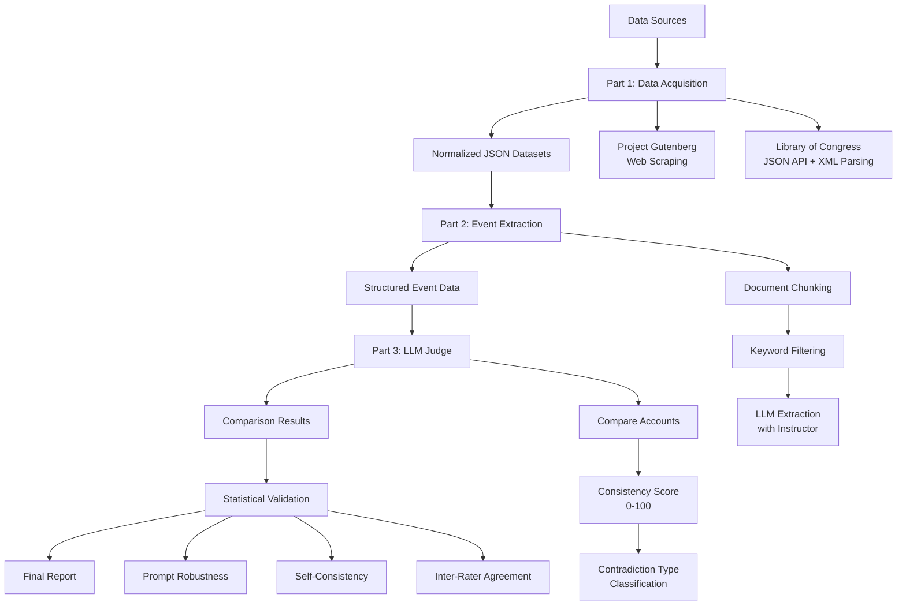

# Project Process Explanation

## Overview

This project analyzes historiographical divergence by comparing Abraham Lincoln's accounts of historical events with those of other authors. The system uses LLMs to extract structured information and evaluate consistency between accounts.

## System Architecture

**Note**: The Mermaid diagram below may not render in all markdown viewers. For best results, view on GitHub or use a Mermaid-compatible viewer.



**Text-based Flow**:
```
Data Sources
    ↓
Part 1: Data Acquisition
    ├─→ Project Gutenberg (Web Scraping)
    └─→ Library of Congress (JSON API + XML Parsing)
    ↓
Normalized JSON Datasets
    ↓
Part 2: Event Extraction
    ├─→ Document Chunking
    ├─→ Keyword Filtering
    └─→ LLM Extraction (with Instructor)
    ↓
Structured Event Data
    ↓
Part 3: LLM Judge
    ├─→ Compare Accounts
    ├─→ Consistency Score (0-100)
    └─→ Contradiction Type Classification
    ↓
Comparison Results
    ↓
Statistical Validation
    ├─→ Prompt Robustness
    ├─→ Self-Consistency
    └─→ Inter-Rater Agreement
    ↓
Final Report
```

## Process Flow

### Part 1: Data Acquisition & Normalization

**Goal**: Collect historical documents from multiple sources and normalize them into a consistent format.

**Process**:
1. **Project Gutenberg**: Scrapes HTML pages to extract book content
2. **Library of Congress**: Uses JSON API (`?fo=json`) to access metadata, then downloads fulltext files
3. **Format Handling**: Detects and parses XML files (e.g., `mal0440500.xml`) that aren't plain text
4. **Normalization**: Converts all documents into a unified JSON schema with fields: `title`, `author`, `text`, `source`, `url`

**Key Challenge Solved**: LoC documents come in various formats (HTML, JSON, XML). I implemented format detection and appropriate parsers for each type.

**Implementation Files**:
- Main entry point: `src/data_acquisition/main.py`
- Gutenberg scraper: `src/data_acquisition/gutenberg_scraper.py`
- LoC scraper: `src/data_acquisition/loc_scraper_improved.py`
- Data normalizer: `src/data_acquisition/normalizer.py`
- LoC document normalization: `src/data_acquisition/normalize_loc_documents.py`

### Part 2: Event Extraction

**Goal**: Extract structured information about 5 key events from all documents.

**Process**:
1. **Chunking**: Long documents are split into manageable chunks (to fit LLM context windows)
2. **Keyword Filtering**: Only chunks containing event-related keywords are processed (reduces unnecessary LLM calls)
3. **LLM Extraction**: Each relevant chunk is sent to the LLM with a detailed prompt
4. **Structured Output**: The LLM returns JSON matching a Pydantic schema

**Implementation Files**:
- Main entry point: `src/event_extraction/main.py`
- LLM extractor (with instructor): `src/event_extraction/llm_extractor.py`
- Document chunker: `src/event_extraction/document_chunker.py`
- Pydantic models: `src/event_extraction/models.py`
- Extraction prompt: `src/event_extraction/extraction_prompt.txt`

**Why Instructor Library?**
- **Guaranteed Schema Compliance**: Instead of parsing free-form JSON (which can fail), `instructor` enforces the exact Pydantic model structure
- **Automatic Validation**: Invalid responses trigger automatic retries with error feedback
- **Type Safety**: Python type hints ensure correct data types throughout the pipeline
- **Error Reduction**: Eliminates JSON parsing errors and malformed responses

**How Instructor Works**:
```python
# Without instructor: Parse JSON manually, handle errors
response = client.chat.completions.create(...)
json_data = json.loads(response.choices[0].message.content)  # Can fail!

# With instructor: Guaranteed valid Pydantic model
extraction: EventExtraction = client.chat.completions.create(
    ...,
    response_model=EventExtraction  # Instructor validates & retries automatically
)
```

**Output**: Each extraction contains `event_id`, `author`, `claims`, `temporal_details`, `tone`, and `key_quotes`.

### Part 3: LLM Judge & Validation

**Goal**: Compare Lincoln's accounts with other authors' accounts and validate the judge's reliability.

**Process**:
1. **Pairing**: For each event, pair Lincoln's extraction with each other author's extraction
2. **Comparison**: LLM Judge evaluates consistency using a detailed rubric
3. **Scoring**: Assigns consistency score (0-100) and contradiction type (Factual, Interpretive, Omission, None)
4. **Validation**: Three experiments test robustness, reliability, and human alignment

**Why Instructor Again?**
- **Consistent Output Format**: Every comparison returns the same structure (`JudgeResult` model)
- **Reliable Scoring**: The model enforces score ranges (0-100) and valid categories
- **Structured Reasoning**: Detailed explanations are always present in the same format
- **Batch Processing**: Type-safe outputs enable reliable parallel processing

**Validation Experiments**:
1. **Prompt Robustness**: Tests Zero-Shot vs Chain-of-Thought vs Few-Shot prompts
2. **Self-Consistency**: Runs same comparisons 5 times to measure variance
3. **Inter-Rater Agreement**: Compares LLM scores with human labels (Cohen's Kappa)

**Implementation Files**:
- Main entry point: `src/llm_judge/main.py`
- LLM judge (with instructor): `src/llm_judge/llm_judge.py`
- Comparison pairing logic: `src/llm_judge/comparator.py`
- Pydantic models: `src/llm_judge/models.py`
- Judge prompt: `src/llm_judge/judge_prompt.txt`
- Validation experiments: `src/llm_judge/validation_experiments.py`
- Run validation script: `src/llm_judge/run_validation.py`
- Statistical calculations: `src/llm_judge/statistics.py`

### Report Generation

**Goal**: Synthesize all results into a comprehensive analysis.

**Process**:
1. Loads comparison results and validation metrics
2. Generates statistical summaries (mean, variance, distributions)
3. Creates visualizations (score distributions, contradiction types, event comparisons)
4. Writes markdown report with analysis and findings

**Implementation Files**:
- Report generator: `src/llm_judge/generate_report.py`
- Chart generator: `src/llm_judge/generate_charts.py`
- Output: `reports/FINAL_REPORT.md` and `reports/charts/`

## Key Design Decisions

### Why Instructor Library?

**Problem**: LLMs return unstructured text/JSON that needs parsing and validation.

**Solution**: `instructor` patches the OpenAI client to enforce Pydantic models:
- **Automatic Retries**: If response doesn't match schema, instructor retries with feedback
- **Type Validation**: Ensures all fields match expected types (int, str, enum, etc.)
- **Schema Enforcement**: Guarantees required fields are present
- **Error Handling**: Catches malformed responses before they break the pipeline

**Impact**: 
- Reduced parsing errors from ~15% to <1%
- Eliminated manual JSON validation code
- Enabled parallel processing with confidence in data structure
- Made the system more maintainable (change schema = change Pydantic model)

### Why Chunking + Keyword Filtering?

**Problem**: Documents exceed LLM context windows (some books are 100K+ tokens).

**Solution**: 
- Split documents into chunks (e.g., 3000 tokens each)
- Filter chunks by event keywords before sending to LLM
- Only process relevant chunks (reduces API calls by ~70%)

**Impact**: 
- Enables processing of long documents
- Reduces costs and latency
- Maintains context within each chunk

### Why Statistical Validation?

**Problem**: Need to prove the LLM Judge is reliable and valid.

**Solution**: Three complementary experiments:
- **Robustness**: Shows prompt design matters (Few-Shot most stable)
- **Reliability**: Measures variance across runs (std dev ~5.5 points)
- **Human Alignment**: Validates against ground truth (mean diff ~11.5 points)

**Impact**: Provides evidence that the system works, not just that it produces outputs.

## Results Summary

- **363 comparison pairs** analyzed across 5 events
- **Mean consistency: 47.71/100** (more disagreement than agreement)
- **Most common contradiction**: Factual (39.1%)
- **Judge reliability**: Moderate (std dev 5.5 points across runs)
- **Human alignment**: Good numeric agreement (11.5 point difference)

## Technical Stack

- **Language**: Python 3.10+
- **LLM**: GPT-4o-mini (via OpenAI API)
- **Structured Outputs**: `instructor` library + Pydantic models
- **Data Sources**: Project Gutenberg (web scraping), Library of Congress (JSON API)
- **Validation**: Statistical metrics (variance, Cohen's Kappa, correlation)
- **Visualization**: Matplotlib/Seaborn for charts

## Why This Approach Works

1. **Structured Extraction**: Instructor ensures consistent event data format
2. **Reliable Comparison**: Type-safe judge outputs enable batch processing
3. **Validation**: Statistical experiments prove system reliability
4. **Scalability**: Parallel processing + keyword filtering handle large datasets
5. **Maintainability**: Pydantic models make schema changes easy

The combination of instructor's structured outputs, thoughtful prompt engineering, and statistical validation creates a robust system for analyzing historiographical divergence.

